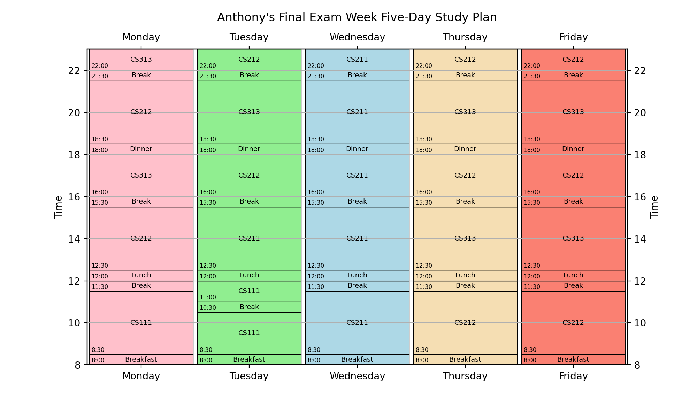

# FinalFocus Planner

## Table of Contents

1. [Overview](#Overview)
2. [Product Spec](#Product-Spec)

## Overview

#### Description

Final Focus Planner is an AI-powered tool that allows students and educational professionals to create personalized study plans for final exam weeks.

## Product Spec

#### Features Implemented: 
- [x] Users can create personalized study plans according to individual factors including time availability, preferences, prioritization, and short-term goals.
- [x] Time is allocated for subjects to maximize study efficiency and overall performance during final exam weeks.

## Example Output for a Student:

